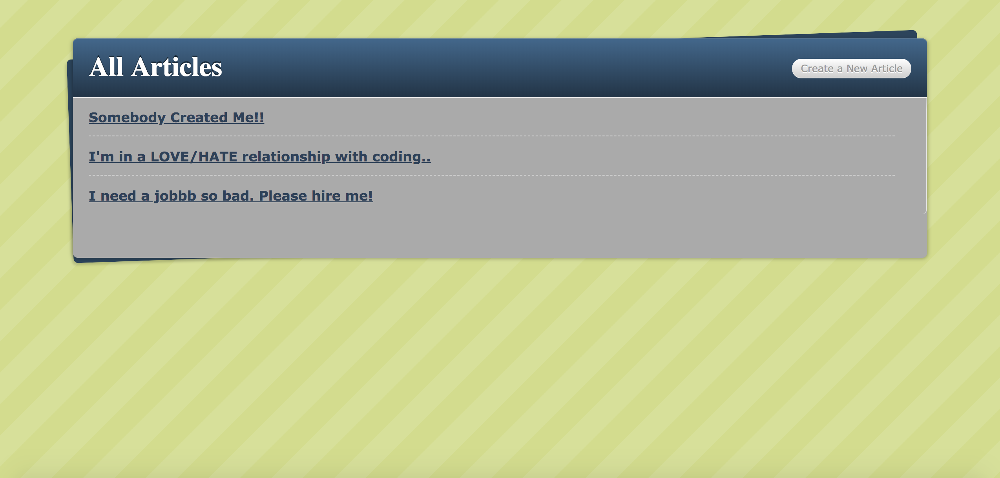

# Blogger - [View in Browser](https://calm-garden-13460.herokuapp.com/)

-This is implementation of rails to create a simple blogger, following the given instructions from zero to completion.  

-Credit to *(http://tutorials.jumpstartlab.com/projects/blogger.html)*, where they had already provided the skeleton code for html/css and provided the instruction of rails in detail. I just simply followed the instructions to get experience of rails. 

